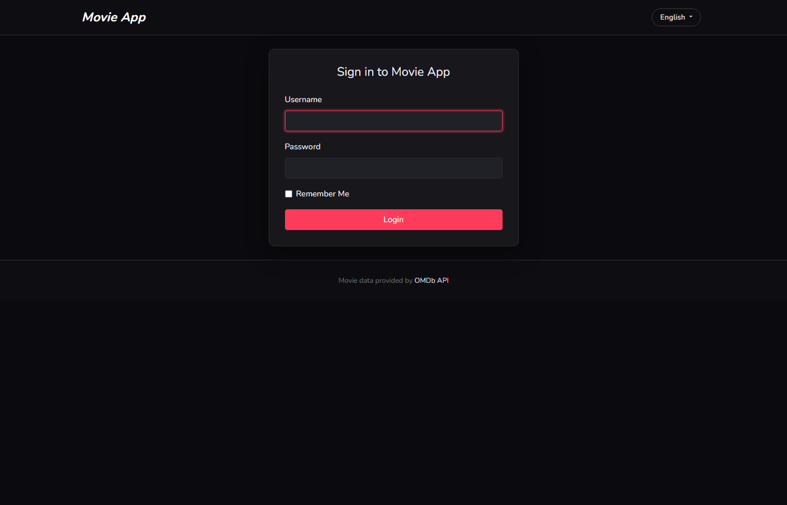
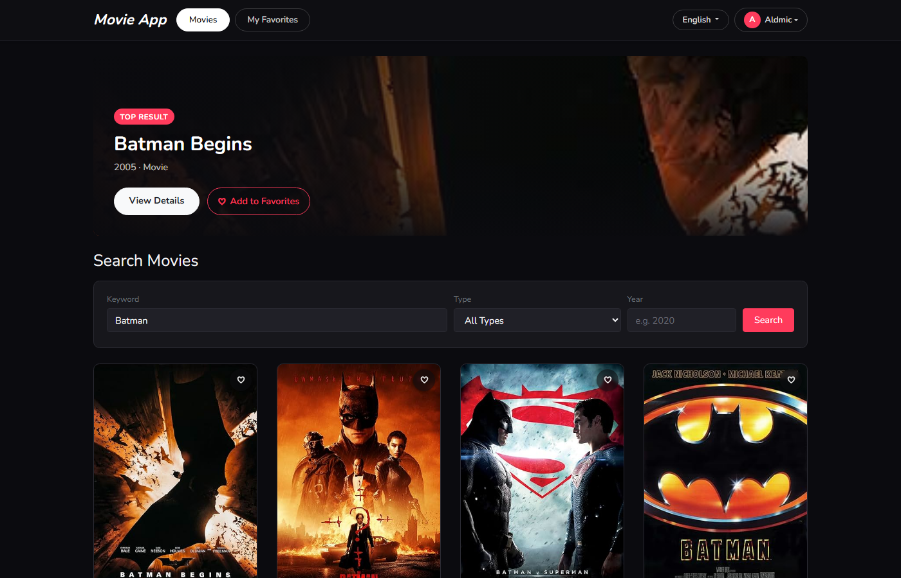
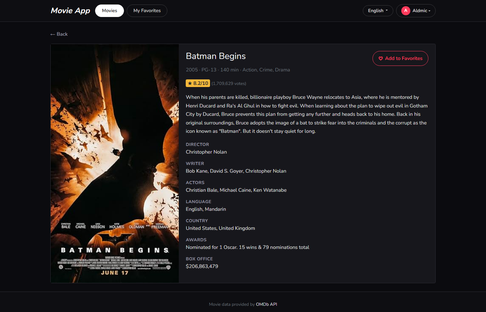
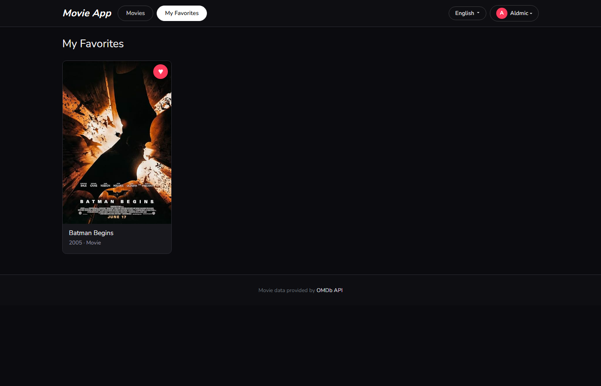
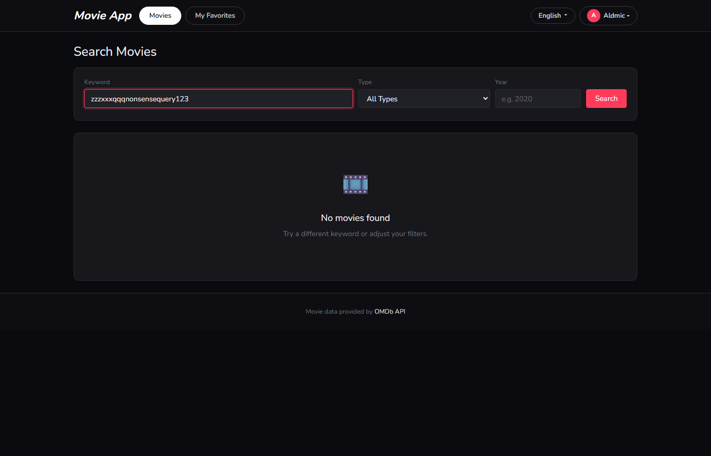
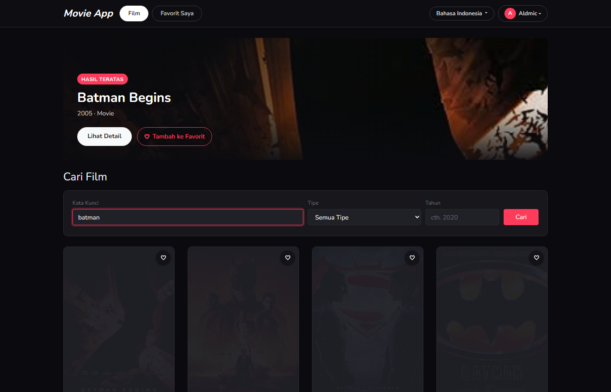
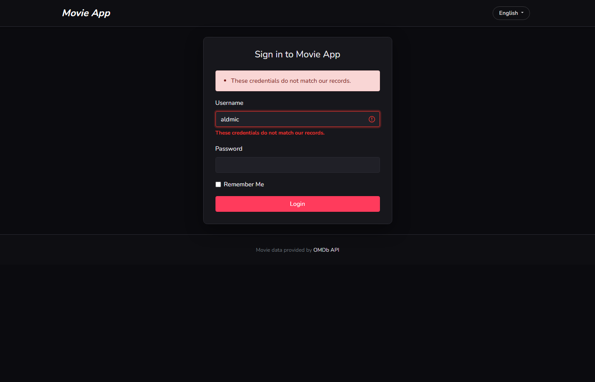

# Movie App — Laravel 5.8 Technical Test

A Laravel 5.8 application for searching movies via the [OMDb API](https://www.omdbapi.com/), viewing movie details, and managing a personal list of favorite movies. Built for the Web Developer Technical Test.

## Demo & Credentials

| | |
|---|---|
| **Demo URL** | _To be added once deployed to the shared/production server — the app is currently finished and verified on local (Laragon)._ |
| **Username** | `aldmic` |
| **Password** | `123abc123` |

## Screenshots

| Login | Movie List (hero banner + default results) |
|---|---|
|  |  |

| Movie Detail | My Favorites |
|---|---|
|  |  |

| No Results Found | Bahasa Indonesia | Invalid Login |
|---|---|---|
|  |  |  |

More flow screenshots (infinite scroll, favorited/un-favorited states, the language dropdown, clearing the keyword field) are in [`screenshots/`](screenshots/).

## Features

- **Login** — the only account is `aldmic` / `123abc123` (seeded via `UserSeeder`). Invalid credentials show a validation error instead of logging in. `/movies`, `/movies/{id}` and `/favorites` all sit behind Laravel's `auth` middleware, redirecting guests to `/login`.
- **Movie List** — search OMDb by keyword, with optional **type** (movie/series/episode) and **year** filters. Results load via AJAX and keep loading as the user scrolls (**infinite scroll**, via `IntersectionObserver` on a sentinel element), 10 results per OMDb page. The page loads with a default keyword (`OMDB_DEFAULT_QUERY` in `.env`, "Batman" out of the box) pre-searched — and falls back to it again any time the keyword field is cleared — since OMDb has no "list all movies" endpoint and the grid should never sit empty just because nothing was typed yet.
- **Hero banner** — the top result of the current search is featured in a large banner (poster backdrop, title, year/type, "View Details" and favorite-toggle actions), similar to a streaming app's showcase panel — built from real OMDb data, not a hardcoded/curated slot.
- **Movie Detail** — full detail (poster, plot, cast, ratings, box office, etc.) for a single title, with a favorite toggle button.
- **Favorites** — add/remove a movie from favorites on the list, hero banner and detail pages (AJAX, no page reload); a dedicated **My Favorites** page lists and lets you remove saved movies.
- **Lazy-loaded posters** — poster `` tags start empty (`data-src`) and are swapped in by an `IntersectionObserver` as they approach the viewport (with a `loading="lazy"` fallback attribute and a graceful degrade for browsers without `IntersectionObserver`). If a poster URL is missing or fails to load (dead link, 404 from OMDb's image CDN), an `onerror` handler swaps it back to the placeholder graphic instead of showing a broken-image icon.
- **Multi-language (EN default / ID)** — a language switcher in the navbar toggles between English and Indonesian for all static UI text (labels, buttons, empty states, validation & auth messages). English is the default and the fallback for any missing translation. **Data returned by the OMDb API (titles, plots, actors, etc.) is never translated**, per the test requirements.
- **Empty states** — dedicated illustrations/messages for a search that legitimately returns zero results and for an empty favorites list.
- **Dark, streaming-app-style UI** — dark theme, pill-shaped nav tabs, and a poster grid modeled after apps like Vidio/Netflix, built with custom Bootstrap 4 variable overrides (see `resources/sass/_variables.scss` and `_movies.scss`).

## Tech Stack / Libraries

| Purpose | Library |
|---|---|
| Framework | **Laravel 5.8** (PHP 7.3) |
| HTTP client (OMDb API) | **GuzzleHttp/Guzzle 7** |
| Auth scaffolding | Laravel's built-in `Illuminate\Foundation\Auth` traits (`make:auth`), customized to authenticate by `username` instead of `email` |
| Database | MySQL 8 (via Eloquent ORM) |
| Frontend build | **Laravel Mix** (Webpack) + **Sass** |
| CSS framework | **Bootstrap 4** (grid, navbar, forms, dropdowns) with a custom Sass theme (`resources/sass/_movies.scss`) |
| JS utilities | **Axios** (AJAX + automatic CSRF via the `XSRF-TOKEN` cookie), **jQuery** + **Popper.js** (Bootstrap's navbar/dropdown widgets) |
| Infinite scroll / lazy load | Native **`IntersectionObserver`** (no extra dependency) |
| Localization | Laravel's built-in translator, using JSON language files (`resources/lang/en.json`, `resources/lang/id.json`) for UI strings, plus `id/auth.php` and `id/validation.php` overrides |

No frontend framework (React/Vue) was used — the pages are server-rendered Blade views progressively enhanced with small, page-scoped vanilla JS modules, which keeps the app simple and fast for the size of this test.

## Architecture

**Server-rendered MVC with an AJAX-driven list page.** Each page (login, movie list, movie detail, favorites) is a Blade view rendered by a thin controller; the movie list additionally calls a JSON endpoint for search/pagination so it can implement infinite scroll without a full framework.

```
routes/web.php
   │
   ├── Auth\LoginController      (username-based login/logout)
   ├── MovieController           index() → view, search() → JSON (AJAX), show() → view
   ├── FavoriteController        index() → view, store()/destroy() → JSON (AJAX)
   └── LocaleController          switch() → stores chosen locale in the session

app/Services/OmdbService.php     Thin wrapper around the OMDb HTTP API (Guzzle),
                                  with response caching (default 60 min, configurable)
                                  so repeat searches/detail views don't burn the free quota.

app/Http/Middleware/SetLocale    Reads the locale from session and applies it via app()->setLocale()
                                  before the request reaches a controller/view.

app/Favorite.php                 Eloquent model, belongsTo User, unique(user_id, imdb_id)
app/User.php                     Eloquent model, hasMany Favorite
```

Key decisions:

- **Controllers stay thin.** All OMDb HTTP concerns (building query params, caching, error handling) live in `OmdbService`, not in the controllers — controllers just call `search()`/`find()` and shape the response.
- **List page = view + JSON endpoint.** `MovieController@index` only renders the shell (search form, empty grid); `MovieController@search` returns JSON consumed by `resources/js/movies.js`. This is what makes infinite scroll possible without re-rendering the whole page on every page of results.
- **Favorites are looked up per-request, not embedded in OMDb data.** The `is_favorite` flag returned by `/movies/search` is computed by diffing the current OMDb results against the logged-in user's `favorites.imdb_id` list, so the heart icon reflects the DB, not OMDb.
- **Favorites store a local snapshot** (title/year/type/poster) instead of re-querying OMDb, so the favorites page renders instantly without another API call.
- **Locale is session-based, not URL-based** (`/lang/{locale}` sets `session('locale')` and redirects back), so the whole app — including validation and auth error messages — stays in the chosen language across requests without prefixing every route.

### Directory highlights

```
app/Services/OmdbService.php        OMDb API client + caching
app/Http/Controllers/MovieController.php
app/Http/Controllers/FavoriteController.php
app/Http/Controllers/LocaleController.php
app/Http/Middleware/SetLocale.php
app/Favorite.php / app/User.php
resources/views/movies/{index,show}.blade.php
resources/views/favorites/index.blade.php
resources/views/auth/login.blade.php
resources/views/layouts/app.blade.php
resources/js/{movies,movie-detail,favorites,favorite,lazyload}.js
resources/sass/_movies.scss
resources/lang/{en.json,id.json,id/auth.php,id/validation.php}
database/migrations/*_create_{users,favorites}_table.php
database/seeds/UserSeeder.php
```

## Setup (Local)

Requirements: PHP 7.1.3+ (developed against **PHP 7.3**), Composer, MySQL, Node.js/npm.

```bash
composer install

cp .env.example .env
php artisan key:generate
# .env already points OMDB_API_KEY at the key provided for this test;
# update DB_* if your MySQL credentials differ from root/(no password).

# create the database (name matches DB_DATABASE in .env, "movie" by default)
mysql -u root -e "CREATE DATABASE movie CHARACTER SET utf8mb4 COLLATE utf8mb4_unicode_ci;"

php artisan migrate
php artisan db:seed   # creates the aldmic / 123abc123 account

npm install
npm run production    # or `npm run watch` while developing

php artisan serve     # http://127.0.0.1:8000
```

### Environment variables added for this project

```
OMDB_API_KEY=c2c85521
OMDB_BASE_URL=https://www.omdbapi.com/
OMDB_CACHE_MINUTES=60
OMDB_DEFAULT_QUERY=Batman
```

## Notes

- Registration and password-reset screens were intentionally removed from the default `make:auth` scaffold — the brief only calls for the single fixed account, so keeping self-service auth screens around would be dead surface area.
- The OMDb "list" endpoint requires a search keyword (there's no "browse all" endpoint on the free plan), so the list page pre-searches a default keyword (`OMDB_DEFAULT_QUERY`) on first load and falls back to it again whenever the keyword field is emptied, so the grid is never blank without reason. The "No movies found" empty state still covers the case that actually matters for the "empty layout" requirement: a search that legitimately returns zero results (see `screenshots/05b-no-results.png`).
- This repository, the write-up and the demo link are shared privately per the test's instructions (not pushed to a public GitHub/GitLab, etc.).
